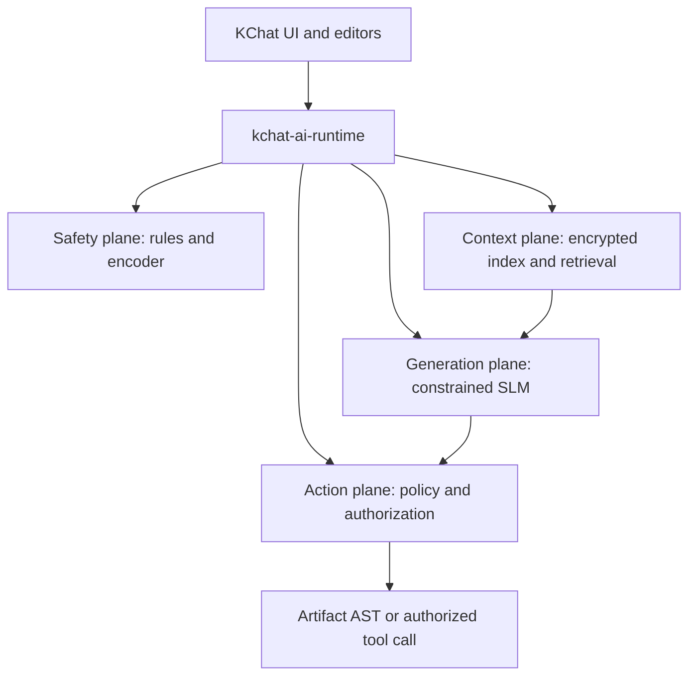

# KChat H2 2026 On-Device AI Architecture

**Status:** Proposed architecture and release plan  
**Planning date:** 4 August 2026  
**Platforms:** iOS, Android, macOS on MacBook, Windows  
**Audience:** Product, platform, ML, security, and enterprise engineering

## Executive decision

KChat should ship one shared on-device AI runtime with separate workload planes, several signed model packs, and a capability-based router. It should not ship one generative model and ask it to perform safety, retrieval, document editing, and tool authorization.

The recommended default portfolio is:

| Workload | All devices | Medium devices | High devices |
|---|---|---|---|
| Guardrail | Deterministic policy engine, signed rules, compact multilingual encoder | Same, with rare SLM adjudication | Same; more policy packs, never an LLM-only gate |
| Private context | Encrypted local store, FTS/BM25, recency, metadata filters | Add a compact multilingual embedding encoder | Add optional reranking and larger retrieval budgets |
| Generation | No mandatory generator; optional 230M to 360M task router or Qwen3-0.6B challenger | Qwen3.5-0.8B Q4 as the default mobile model; Qwen3.5-2B Q4 on desktop | Qwen3.5-2B Q4 on mobile; Qwen3.5-4B Q4 on desktop |
| Productivity and microapps | Typed, constrained operations only | Multi-step plans within strict schemas | Longer synthesis and larger plans, still schema-bound |

Five decisions should be made now:

1. **Correct the model name.** The small model is [Qwen3.5-0.8B](https://huggingface.co/Qwen/Qwen3.5-0.8B), not “Qwen 3.6 0.8B.” The [Qwen3.6 family](https://github.com/QwenLM/Qwen3.6) does not provide that small open checkpoint.
2. **Use standard GGUF and llama.cpp as the dependable generative baseline.** Add MLX, LiteRT-LM, and OS-provided models only as qualified acceleration providers.
3. **Keep PrismML Bonsai in a challenger lane.** [Ternary-Bonsai-1.7B](https://huggingface.co/prism-ml/Ternary-Bonsai-1.7B-gguf) and [Ternary-Bonsai-4B](https://huggingface.co/prism-ml/Ternary-Bonsai-4B-gguf) are attractive on size and CPU throughput, but Q2_0 support is transitional across group sizes and accelerated backends. Some newer paths are reaching mainline while other paths still require PrismML-specific work. KChat should not make it the only production path in H2 2026.
4. **Download model packs after installation.** Bundle the deterministic guardrail and basic lexical context layer in the app. Fetch the generative model over Wi-Fi after capability detection and user or tenant policy approval.
5. **Treat the model as an untrusted planner.** Authorization, tenant identity, data scopes, mutation approval, artifact validation, and audit remain deterministic application responsibilities.

## What the four reference repositories imply

### 1. Guardrail

The [slm-guardrail README](https://github.com/kennguy3n/slm-guardrail/blob/main/README.md), [architecture](https://github.com/kennguy3n/slm-guardrail/blob/main/ARCHITECTURE.md), and [model assets](https://github.com/kennguy3n/slm-guardrail/blob/main/MODEL_ASSETS.md) already use the right layered shape:

- deterministic prefilters and signed policy packs;
- a compact XLM-R-style classifier through ONNX INT8 or INT4;
- optional llama.cpp SLM adjudication;
- Rust core with UniFFI for Swift/Kotlin and N-API for Electron;
- a closed output schema and a contract that plaintext, embeddings, and hashes do not leave the device.

KChat should reuse this design. The generative model must not be called on every message. The normal hot path is deterministic evaluation, followed by the encoder only when rules or uncertainty require it. A small SLM may adjudicate ambiguous cases on medium and high tiers. Safety must remain operational on low-tier devices with no generative pack installed.

### 2. Private context

The [knowledge README](https://github.com/kennguy3n/knowledge/blob/main/README.md), [inference routing](https://github.com/kennguy3n/knowledge/blob/main/docs/technical/inference-routing.md), and [device benchmark plan](https://github.com/kennguy3n/knowledge/blob/main/docs/technical/benchmarks-device.md) provide a suitable Rust substrate:

- SQLCipher-backed local storage;
- lexical and hybrid retrieval;
- connectors, provenance, and encrypted multi-device synchronization;
- constrained classification, extraction, and synthesis tasks;
- low, medium, and high routing.

Two changes are required. First, routing must be workload-specific because the best backend for an encoder is not necessarily the best backend for text generation. Second, real phone and laptop results must replace server proxy numbers before launch. “Local inference” also does not mean zero operating cost. Model distribution, connector processing, test infrastructure, support, and battery cost remain.

### 3. Productivity

The [Tessera README](https://github.com/kennguy3n/Tessera/blob/main/README.md) and [architecture](https://github.com/kennguy3n/Tessera/blob/main/ARCHITECTURE.md) establish a good desktop pattern: Electron and React UI, a Rust native core, local knowledge, model sidecar, artifact versioning, and editors for documents, slides, sheets, bases, and other structured outputs.

KChat should reuse the artifact model and native core concepts, not port the whole desktop application to mobile. Mobile should use native editors or thin views over the same canonical artifact AST. AI outputs should be operations such as `replace_range`, `insert_slide`, `set_formula`, or `update_record`, never arbitrary DOCX/PPTX/XLSX XML, JavaScript, SQL, macros, or filesystem commands.

The current [Tessera model registry](https://github.com/kennguy3n/Tessera/blob/main/sidecars/models.json) contains null SHA-256 values for several model and runtime assets. That is a release blocker. Production assets need pinned origins, non-null digests, licenses, runtime ABI requirements, signatures, rollout cohorts, and rollback metadata.

### 4. Microapps

The [kapp-fab README](https://github.com/kennguy3n/kapp-fab/blob/main/README.md), [architecture](https://github.com/kennguy3n/kapp-fab/blob/main/ARCHITECTURE.md), and [tool executor](https://github.com/kennguy3n/kapp-fab/blob/main/internal/agents/executor.go) contain the right action controls: dry-run, commit, confirmation for destructive calls, audit, and role-based field redaction.

KChat must harden one boundary explicitly. Tenant ID, actor ID, user roles, and data scopes must come from the authenticated application or server context. They must never come from a model-produced invocation. Every operation is reauthorized after planning and immediately before execution.

### Reference implementation readiness

The repositories are valuable architecture inputs, not drop-in production modules. The GitHub review found these concrete blockers:

| Repository | Reuse | Block before KChat production |
|---|---|---|
| slm-guardrail | Normalization, deterministic detectors, policy interpreter, signed-pack design, encoder/head design | The intended INT4 encoder entry in the [asset manifest](https://github.com/kennguy3n/slm-guardrail/blob/main/model-asset-manifest.json) has a placeholder zero digest; expose a complete deterministic-only classify API; bound skill-pack decompression; pin runtime commits; wire native Keychain/Keystore/DPAPI storage; define policy-controlled degraded behavior |
| knowledge | SQLCipher evidence store, per-scope encryption, FTS schema, provenance, permission concepts, connector contracts, CRDT primitives | The public mobile query is lexical-only; iOS/Android generative adapters are not implemented; connector sync currently does not fetch source bodies and ignores deletion/permission changes; webhook signature headers are not wired; model hashes are placeholders; root keys cross FFI as hex strings |
| Tessera | Desktop editor implementations, hybrid retrieval pattern, bounded skill steps, artifact versioning, idle sidecar lifecycle | It is desktop Electron, not a mobile SDK; [model and runtime hashes are null](https://github.com/kennguy3n/Tessera/blob/7ca1451f781670390a16971de774a17be7514005/sidecars/models.json); Rust, Electron, and JSON registries disagree; grammar fields are not wired to generation; release packaging can omit native/runtime assets |
| kapp-fab | Business schemas, API/BFF authorization path, dry-run/commit, confirmation, audit, signed extension bundle design | The standalone agent service can trust client actor/role fields, and the inspected [KChat bridge](https://github.com/kennguy3n/kapp-fab/blob/e15da9d48c69f6e44877cac43c7bb72a863e9903/services/kchat-bridge/main.go) has no authentication/tenant middleware; tool JSON Schemas are not published; marketplace UI sandbox is not implemented; extension fetch/webhook paths need SSRF controls |

For KChat, one owned capability broker should replace the separate repo-level inference and identity paths. Fix the unauthenticated KChat bridge before any network deployment. The bridge should accept signed KChat envelopes over mTLS or a private service mesh, derive user and tenant identity server-side, and enforce the same RBAC, quota, confirmation, and audit policy as the primary API.

## Target architecture

### Shared runtime

Build `kchat-ai-runtime` as a Rust core shared by all four platforms:

- **Capability probe:** physical memory, safe allocatable memory, ISA, CPU core classes, GPU backend, available NPU provider, free storage, battery, thermal state, and app background state.
- **Workload router:** selects model, backend, context budget, thread count, and local or approved remote execution per task.
- **Model manager:** signed manifests, resumable downloads, memory mapping, version coexistence, health checks, rollback, and kill switch.
- **Safety plane:** deterministic rules, encoder classification, policy evaluation, signed policy packs, and optional adjudication.
- **Context plane:** encryption, scopes, FTS/BM25, embeddings, reranking, citations, connector provenance, and prompt-injection labeling.
- **Generation plane:** prompt templates, grammar-constrained decoding, token limits, cancellation, and one active generative model on mobile.
- **Action plane:** capability grants, authorization, schema validation, dry-run, user confirmation, commit, and structured audit.
- **Scheduler:** memory pressure response, thermal throttling, battery budgets, background restrictions, and idle unloading.
- **Private telemetry:** aggregate latency, crashes, memory, thermal events, schema success, and model version without raw messages or retrieved text.

Expose it through UniFFI to Swift and Kotlin and through N-API to the desktop shell. On desktop, the generative process may remain a crash-isolated sidecar. Bind it to a Unix domain socket, a Windows named pipe, or `127.0.0.1` with a random per-launch credential. Disable network egress and any runtime web UI.

### Workload-specific backend order

| Workload | Preferred order |
|---|---|
| Safety classifier | Deterministic Rust, ONNX Runtime CPU/XNNPACK, then Core ML or NNAPI/QNN only after exact-model qualification |
| Embeddings | FTS/BM25 always, ONNX Runtime compact encoder on medium+, accelerator only when it improves end-to-end energy and latency |
| Generative text | llama.cpp CPU/GPU baseline, then qualified MLX or LiteRT-LM provider, then supported OS model, then privacy-approved remote inference |
| Artifact operations | Deterministic AST validator and renderer; model only proposes typed operations |
| Microapp tools | Deterministic policy broker and server-side authorization; model only proposes a plan |

[ONNX Runtime Mobile](https://onnxruntime.ai/docs/tutorials/mobile/) is the recommended encoder runtime because it has CPU support on both mobile platforms and optional Core ML, XNNPACK, NNAPI, and QNN execution providers. Hardware acceleration must be proven per graph. Partial graph partitioning can lose to a well-tuned CPU path.

[llama.cpp](https://github.com/ggml-org/llama.cpp) should be the standard GGUF baseline for widest CPU, Metal, Vulkan, and desktop GPU coverage. KChat should own and pin the exact runtime builds used in release artifacts.

## Capability tiers

Device tier is a runtime decision, not a marketing label. A high-end phone under memory pressure or serious thermal state must temporarily route as medium or low. An inexpensive desktop with 16 GB RAM and a strong AVX2 CPU may run the medium pack well without an NPU.

### Platform launch matrix

The memory figures below are KChat peak AI working-set budgets, not model file sizes. They are initial release gates to validate on real devices.

| Platform | Tier | Representative launch envelope | Default generative pack | Active context cap | Peak AI memory budget | Primary path |
|---|---|---|---|---:|---:|---|
| iOS | Low | 4 GB class, 64-bit NEON, no assumed generative accelerator | 230M to 360M narrow model; Qwen3-0.6B challenger | 2K | 0.75 GB | CPU |
| iOS | Medium | 6 GB class, Metal-capable | Qwen3.5-0.8B Q4 | 4K | 1.4 GB | llama.cpp Metal/CPU; MLX after qualification |
| iOS | High | 8 GB+ class, recent Apple silicon, OS model may be available | Qwen3.5-2B Q4 | 8K | 2.5 GB | Metal; optional Apple model provider |
| Android | Low | 4 to 6 GB class, Arm64 NEON, weak or inaccessible accelerator | 230M to 360M narrow model; Qwen3-0.6B challenger | 2K | 0.75 GB | CPU |
| Android | Medium | 6 to 8 GB, modern big cores, Vulkan may be useful | Qwen3.5-0.8B Q4 | 4K | 1.5 GB | llama.cpp CPU/Vulkan; LiteRT-LM challenger |
| Android | High | 12 GB+, recent flagship GPU/NPU | Qwen3.5-2B Q4 | 8K | 3.0 GB | qualified CPU/GPU/NPU provider |
| MacBook | Low | 8 GB unified memory, Apple silicon or supported AVX2 fallback | Qwen3.5-0.8B Q4 | 4K | 2.0 GB | Metal or CPU |
| MacBook | Medium | 16 to 24 GB Apple silicon | Qwen3.5-2B Q4 | 8K | 4.0 GB | Metal or MLX after qualification |
| MacBook | High | 32 GB+ unified memory | Qwen3.5-4B Q4 | 16K | 8.0 GB | Metal/MLX |
| Windows | Low | 8 GB, x64 AVX2 or Arm64 NEON, no assumed accelerator | Qwen3.5-0.8B Q4 | 4K | 2.0 GB | llama.cpp CPU |
| Windows | Medium | 16 GB, AVX2/VNNI or useful iGPU/NPU | Qwen3.5-2B Q4 | 8K | 4.0 GB | CPU/GPU; Windows ML challenger |
| Windows | High | 32 GB+, 8 GB VRAM or qualified modern NPU | Qwen3.5-4B Q4 | 16K | 8.0 GB | GPU/NPU |

For high-tier desktop users, a Qwen3.5-9B Q4 pack around 5.7 GB may be an opt-in power-user option, not the mass-market default. It needs a separate 32 GB+ and performance-qualified tier. The official [Qwen3.5-9B](https://huggingface.co/Qwen/Qwen3.5-9B) weights are available, and one current Q4_K_M conversion is [about 5.68 GB](https://huggingface.co/unsloth/Qwen3.5-9B-GGUF/blob/main/Qwen3.5-9B-Q4_K_M.gguf).

### Tier selection rules

At installation or first model use:

1. Detect hardware and operating-system capabilities.
2. Run a 2 to 5 second local calibration on the exact encoder and a tiny generative prompt.
3. Verify safe allocation and memory-map behavior under normal KChat load.
4. Select a maximum eligible tier.
5. Re-evaluate before each job using free memory, thermal state, battery, and background status.
6. Downgrade immediately after allocation failure, repeated slow TTFT, critical thermal events, or OS termination signals.

Enterprise policy may cap the tier or disable local generation, remote generation, connectors, or specific model licenses. It may not elevate a device beyond a measured safe tier.

## Model portfolio

### Recommended production and challenger set

| Model | Approximate artifact size | Production role | Why | Main risk |
|---|---:|---|---|---|
| FunctionGemma 270M or KChat-distilled 230M to 360M model | About 0.20 to 0.40 GB, format dependent | Low-tier route, extract, classify, and short structured edit | Fits the low storage and memory envelope; can be fine-tuned to KChat schemas | Not a general assistant; [FunctionGemma](https://ai.google.dev/gemma/docs/functiongemma) requires task fine-tuning and Gemma license review |
| Qwen3-0.6B Q3/Q4 | 0.35 to 0.48 GB | Low-tier narrow generation | Apache 2.0, mainline GGUF, multilingual, fits the requested low storage range at Q3 | Limited reliability; must use non-thinking, narrow tasks, grammar, and short outputs |
| Qwen3.5-0.8B Q4 | About 0.58 GB | Medium mobile and low desktop default | Newer hybrid architecture, 201 languages claimed, compact recurrent/attention cache profile | Weak agent benchmarks relative to larger models; not a general office copilot |
| Qwen3.5-2B Q4 | About 1.4 GB | High mobile and medium desktop | Material quality gain while still feasible on selected phones and mainstream laptops | Mobile peak memory and sustained thermal load |
| Qwen3.5-4B Q4 | About 2.6 to 2.9 GB | High desktop default | Better instruction following, multilingual generation, and tool planning | Too large for mass mobile default |
| Bonsai-1.7B Q1_0 | About 0.25 GB | Low-tier challenger | Very small 1-bit artifact | Vendor-specific quality and runtime path; lower reported quality than ternary version |
| Ternary-Bonsai-1.7B Q2_0 | About 0.44 GB | Low/medium challenger | Strong size-to-parameter ratio and CPU-oriented design | Q2_0 compatibility and backend maturity |
| Ternary-Bonsai-4B Q2_0 | About 1.02 GB | Medium/high CPU challenger | Attractive desktop CPU and storage profile | Same runtime risk; vendor flagship results are not KChat device evidence |

The Qwen3-0.6B 4-bit size depends on the quantization recipe. Current community artifacts range from [about 397 MB](https://huggingface.co/unsloth/Qwen3-0.6B-GGUF/blob/main/Qwen3-0.6B-Q4_K_M.gguf) to [about 484 MB](https://huggingface.co/lmstudio-community/Qwen3-0.6B-GGUF). KChat should build its own reproducible quantization from the [official Apache 2.0 checkpoint](https://huggingface.co/Qwen/Qwen3-0.6B), then choose Q3 or Q4 from its own task suite.

Qwen3.5-0.8B is useful only with realistic expectations. Its [official model card](https://huggingface.co/Qwen/Qwen3.5-0.8B) positions it for prototyping and task-specific fine-tuning, and published tool-use scores are far below the 2B and 4B siblings. Use its non-thinking mode, strict grammars, bounded inputs, and KChat-specific distillation or fine-tuning. Do not expose unconstrained autonomous tool loops.

PrismML reports favorable size and throughput for its [1.7B ternary](https://huggingface.co/prism-ml/Ternary-Bonsai-1.7B-gguf) and [4B ternary](https://huggingface.co/prism-ml/Ternary-Bonsai-4B-gguf) models. Treat those numbers as hypotheses. Q2_0 compatibility differs by group size, runtime revision, and backend, and visible failures such as [Bonsai-demo issue 88](https://github.com/PrismML-Eng/Bonsai-demo/issues/88) show why the exact artifact/runtime pair must be pinned. A production decision requires correctness, quality, crash, battery, and backend coverage on the full KChat matrix.

There is no honest 300 to 400 MB general model that can reliably own all four KChat use cases. In that envelope, the production choice should be a task-specific 230M to 360M router/extractor plus deterministic safety and retrieval. Qwen3-0.6B Q3/Q4 is the broader-language challenger. FunctionGemma is the specialized tool-routing challenger. Both require KChat fine-tuning, bounded output, and deterministic validation.

### Compact non-generative packs

| Pack | Target size | Placement | Purpose |
|---|---:|---|---|
| Deterministic safety and language rules | 3 to 10 MB | Bundled on all devices | Fast, offline, policy-controlled filtering and routing |
| Multilingual safety encoder, INT4/INT8 | 50 to 100 MB | Bundled or first-run background download | Ambiguous content classification |
| Tokenizer and normalization assets | 10 to 30 MB | Shared where licenses and vocab permit | Avoid duplicate package cost |
| Compact multilingual embedding encoder | 60 to 150 MB quantized target | Medium+ download | Semantic retrieval of chat and artifacts |
| Optional reranker | 100 to 300 MB target | High desktop or server | Better top-result ordering for complex searches |

Low tier should still have useful retrieval with FTS/BM25, recency, contacts/entities, conversation scopes, and deterministic extraction. Dense embeddings are an enhancement, not an availability requirement. Candidate encoders such as [multilingual-e5-small](https://huggingface.co/intfloat/multilingual-e5-small) and [paraphrase-multilingual-MiniLM-L12-v2](https://huggingface.co/sentence-transformers/paraphrase-multilingual-MiniLM-L12-v2) should be compared on KChat languages and remote-artifact data before selection.

### Memory and context policy

A 400 MB model file does not mean a 400 MB working set. Peak use includes mapped weights, runtime code, tokenizer, graph buffers, activations, prompt tokens, attention or recurrent state, output buffers, and the surrounding KChat process.

Approximate architecture-derived planning values illustrate the difference:

- Qwen3.5-0.8B and 2B full-attention KV is about 12 KB per token in FP16, or roughly 48 MB at 4K and 96 MB at 8K, plus recurrent state, weights, activations, and runtime scratch.
- Qwen3.5-4B full-attention KV is about 32 KB per token in FP16, or roughly 128 MB at 4K, 256 MB at 8K, and 512 MB at 16K, plus the other allocations.
- Ternary-Bonsai-4B keeps a conventional transformer cache of roughly 144 KB per token in FP16, or about 576 MB at 4K and 1.1 GB at 8K before activations and scratch. Ternary weights reduce storage and weight memory, not KV or activation memory.

These are planning calculations from published configurations, not measured KChat RSS. Release decisions use measured peak memory on the exact model, quantization, runtime, and device.

Rules for H2 2026:

- Cap context at 2K low, 4K medium, 8K high mobile, and 8K to 16K high desktop. Ignore advertised 32K, 262K, or 1M windows for mass on-device use.
- Retrieve a small number of authorized chunks rather than stuffing complete histories or documents into the prompt.
- Keep at most one generative model resident on mobile.
- Memory-map immutable weights and unload the model after 30 to 60 seconds of mobile idle.
- Drop KV or recurrent conversation state when the task ends. Persist a textual or structured summary, not opaque model state.
- Quantize KV cache only after measuring task quality. Start with Q8 cache where supported.
- Reject or reroute a task before allocation if the predicted peak exceeds 70 percent of the currently safe AI budget.

Qwen3.5's hybrid Gated DeltaNet and sparse full-attention layout makes its context-state growth more attractive than a similarly sized full-attention model, but the exact llama.cpp and platform RSS must still be measured. The active cap remains a product policy, independent of the model's advertised maximum.

## Use-case implementation

### Guardrail flow

1. Normalize text locally after decryption.
2. Apply signed deterministic policy, allowlists, blocklists, rate signals, and conversation-state rules.
3. If confidence is insufficient, run the compact encoder.
4. On eligible medium/high devices, invoke the SLM for a small ambiguous subset with a closed JSON grammar.
5. Apply deterministic policy to the structured result.
6. Return allow, warn, block, redact, or require-consent with stable reason codes.

Targets:

- deterministic path P95 below 5 ms;
- encoder path P95 below 150 ms on qualified devices;
- no raw message telemetry;
- protected speech, quoted material, counterspeech, and multilingual code-switching included in false-positive tests;
- fail-safe rules defined per risk category rather than one global “block on error” switch.

### Private local and remote context

Local chat and artifacts should be indexed under explicit scopes: user, account, workspace, conversation, participant, source, record ACL, retention class, and time. Retrieval checks authorization before search, filters candidates during search, and checks again when constructing the prompt.

Remote systems need three deployment modes:

| Mode | Connector location | Server visibility | Best fit |
|---|---|---|---|
| Local connector | User device | Relay sees ciphertext and metadata only where possible | Maximum privacy, smaller source set, interactive sync |
| Managed connector | KChat regional service | Authorized service processes source plaintext | Consumer and mass business with clear policy and residency controls |
| Enterprise connector | Customer VPC or controlled enclave | Customer-defined | Strict enterprise sources and data residency |

Every retrieved item carries source, timestamp, ACL version, provenance, and citation location. Remote documents and chat messages are untrusted content. Text that says “ignore previous instructions,” requests secrets, or impersonates a tool policy remains data and cannot change the system prompt, tool grants, or authorization policy.

Retrieval tiers:

- **Low:** FTS/BM25, field filters, recency, deterministic entity extraction, and small query expansion tables.
- **Medium:** add multilingual dense embeddings and hybrid fusion.
- **High:** add a reranker for the top candidates and larger citation budgets.

### Documents, slides, sheets, and bases

Use one versioned artifact schema across platforms. Each AI request includes selected content, nearby structure, authorized retrieved evidence, user intent, and an output grammar for typed operations.

| Tier | Product capability |
|---|---|
| Low | Rewrite selected text, summarize a short selection, extract fields, generate a formula AST, fill a fixed slide/template slot |
| Medium | Build an outline, apply several bounded edits, create a short slide plan, transform a table, classify or enrich base rows |
| High | Multi-section synthesis, cited document drafting, multi-slide narrative, larger spreadsheet transformations, cross-source analysis |

All tiers use deterministic validation:

- operations reference stable artifact node IDs and expected versions;
- formulas parse to an allowed formula AST and never become macros or code;
- database/base updates use typed fields and policy-checked record IDs;
- the renderer creates office formats from validated ASTs;
- preview and undo are mandatory for multi-node changes;
- stale-version conflicts are shown or merged, not silently overwritten.

### Microapps in chat

The model emits a `ToolPlan`, not an executable request. Each app has a signed manifest containing tool schemas, requested capabilities, data scopes, network destinations, side effects, confirmation class, and publisher identity.

Execution policy:

| Class | Default behavior |
|---|---|
| Read-only, low sensitivity | May auto-run with time, row, and frequency limits |
| Local reversible mutation | Dry-run, preview, explicit confirmation, commit |
| External mutation | Reauthorize server-side, show target and effect, explicit confirmation |
| Finance, HR, admin, export, bulk action | Step-up authentication and policy approval; two-step commit where required |

The server derives tenant, actor, roles, and source scopes from the authenticated session. It ignores those fields if the client or model supplies them. Unauthorized committed actions must be zero in the release gate suite.

## Platform runtime choices

### iOS and MacBook

- Ship the Rust core, ONNX Runtime encoder path, and llama.cpp baseline.
- Use Metal for qualified generative models where it beats CPU on energy and latency.
- Evaluate [MLX Swift LM](https://github.com/ml-explore/mlx-swift-lm) for Apple-silicon acceleration and grammar-constrained generation. Pin a release and run exact-output correctness tests. Current ecosystem issues include an [iOS Conv1d long-sequence problem](https://github.com/ml-explore/mlx-swift/issues/424), which is relevant to hybrid models.
- Offer Apple's [Foundation Models framework](https://developer.apple.com/videos/play/wwdc2025/286/) as an optional provider on supported Apple Intelligence devices and regions. It cannot be the cross-platform behavior contract.
- Use iOS background-task and thermal APIs. Suspend generation when backgrounded unless a narrowly approved OS task permits completion.

### Android

- Ship Arm64 NEON CPU as the correctness baseline and qualify Vulkan only on device families where it improves total task energy.
- Use ONNX Runtime CPU/XNNPACK for encoder workloads, then qualify NNAPI or QNN on exact graphs.
- Evaluate Google's [LiteRT-LM](https://developers.google.com/edge/litert-lm/overview) as the H2 2026 Android challenger. It exposes C++/Kotlin APIs, constrained decoding, function calling, and CPU/GPU paths. Its current declared model set includes Qwen3 and Gemma/FunctionGemma paths, not a guaranteed Qwen3.5 conversion path. Its NPU and some cross-platform paths remain device and maturity dependent.
- Offer [Gemini Nano through Android AICore/ML Kit GenAI](https://developer.android.com/ai/gemini-nano) only as an optional provider on supported devices. The OS controls availability and model lifecycle.
- Maintain chipset and driver denylists. A claimed Vulkan or NPU feature is not enough to select that backend.

### Windows

- Keep x64 AVX2 and Arm64 NEON llama.cpp paths as the broad baseline.
- Add GPU backends per tested vendor and driver range.
- Evaluate [ONNX Runtime GenAI](https://github.com/microsoft/onnxruntime-genai) plus [Windows ML](https://learn.microsoft.com/en-us/windows/ai/overview) for Qwen3.5/ONNX models and runtime-managed CPU, GPU, and NPU execution providers.
- Offer [Phi Silica](https://learn.microsoft.com/en-us/windows/ai/apis/phi-silica) or Windows Text Intelligence Skills only as optional system providers. Availability, geography, hardware, API maturity, and limited-access conditions prevent them from being the core KChat contract.
- Treat [experimental GPU support listed in the Windows AI API matrix](https://learn.microsoft.com/en-us/windows/ai/apis/) as experimental until it reaches the release channel KChat supports.

## Battery, thermal, and responsiveness policy

### Mobile

- Use two performance cores at low tier and no more than three to four at medium/high unless profiling proves a better energy point.
- Do not run generative inference in the guardrail hot path.
- Pause indexing on serious or critical thermal state.
- Schedule bulk embedding on charging power and unmetered network through platform-approved background work.
- Cancel generation on background transition unless the user initiated an eligible foreground continuation.
- Use task output caps: 64 to 192 tokens low, 256 to 512 medium, and 512 to 1,024 high.
- Stream visible output but validate the complete structured object before any side effect.
- Target an incremental daily AI battery cost at or below 3 percent at P50 and 5 percent at P90 under the KChat daily-use trace.

### Desktop

- Favor responsiveness over maximum core occupancy. Reserve capacity for UI, audio/video calls, synchronization, and editors.
- Default CPU thread count to half the logical cores with a bounded maximum, then tune by calibration.
- Release prompt state after each task and unload idle high-tier models after a configurable period.
- On battery-powered laptops, reduce context and output budgets and prefer the smaller model unless the user opts into maximum local quality.

## Security and model supply chain

Every model pack and runtime binary needs a signed manifest with:

- model, tokenizer, projector, adapter, and runtime SHA-256 digests;
- source repository and exact source revision;
- quantization recipe and build environment;
- license and product-use approval;
- runtime ABI and backend requirements;
- minimum application and OS versions;
- task capabilities and eligible tiers;
- expected file and peak working-set sizes;
- evaluation suite version and results digest;
- rollout cohort, expiry, kill switch, and rollback target;
- Ed25519 or platform-equivalent signature rooted in KChat release keys.

Build or requantize production weights from official sources in a reproducible pipeline. Generate an SBOM for native runtimes, scan model archives, notarize or code-sign binaries, and prohibit executable content inside model packs.

Distribute content-addressed chunks of 8 to 16 MB with resumable download, per-chunk verification, final manifest verification, atomic activation, and coexistence of current plus previous versions during rollout. Never replace a complete multi-gigabyte pack when only a small adapter or tokenizer changed.

Prompt injection and tool security rules:

- system and developer policy are compiled application inputs, never retrieved text;
- retrieved instructions are labeled as data;
- tool schemas are local signed resources;
- the model cannot grant capabilities or widen scopes;
- secrets are fetched by the executor only after authorization and are not placed in the planning prompt;
- side effects use dry-run and commit tokens bound to actor, target, parameters, expiry, and artifact version;
- audit records structured actions and policy outcomes, with raw content retained only under explicit tenant policy.

## Real-device release gates

Vendor benchmarks are useful for candidate screening. They are not release evidence. Create a KChat Real Device Lab with at least three representative devices in each platform-tier cell that matters commercially. Include aging batteries, low-storage states, common Southeast Asian and global chipsets, and enterprise endpoint controls.

### Performance gates

These are proposed starting gates. Replace them with observed distributions before general availability.

| Tier | Mobile TTFT P95 | Mobile decode P50 | Peak AI memory | Desktop decode P50 |
|---|---:|---:|---:|---:|
| Low | <= 2.5 s | >= 8 tok/s | <= 0.75 GB | >= 10 tok/s |
| Medium | <= 1.5 s | >= 15 tok/s | <= 1.5 GB | >= 20 tok/s |
| High | <= 1.0 s | >= 25 tok/s | <= 2.5 to 3.0 GB | >= 35 tok/s |

Also gate:

- cold model load, warm TTFT, prefill rate, decode rate, peak RSS, mapped bytes, and allocation failures;
- 1-minute, 5-minute, and 10-minute power and thermal traces;
- UI jank, ANR, watchdog termination, crash rate, and background cancellation;
- result quality after every runtime, quantization, prompt-template, and tokenizer change.

### KChat Task Suite

Cover English and KChat priority markets, including Vietnamese, Thai, Indonesian, Malay, Tagalog, Arabic, Chinese, Japanese, Korean, Hindi, French, German, Spanish, and Portuguese. Include code-switching and informal chat.

| Plane | Required metrics |
|---|---|
| Guardrail | Precision, recall, category calibration, false positives on protected speech/quotation/counterspeech, adversarial obfuscation, latency |
| Retrieval | Recall@10, nDCG@10, citation accuracy, freshness, ACL leakage, deleted-item removal, multilingual queries |
| Productivity | Schema validity, operation replay, formula correctness, artifact render success, evidence grounding, undo success |
| Microapps | Tool exact match, argument exact match, confirmation behavior, prompt-injection resistance, unauthorized side effects |
| Generation | Task success, hallucination rate, language quality, truncation, repetition/looping, user edit distance |

Hard gates:

- **0** cross-tenant or out-of-scope retrievals in the security suite;
- **0** unauthorized committed tool actions;
- **100 percent** artifact operations parse before execution;
- **>= 99.9 percent** valid constrained tool and artifact outputs on the qualified task set;
- no serious or critical thermal state during the normal 5-minute interactive workload;
- battery target at or below 3 percent P50 and 5 percent P90 incremental daily use.

The 99.9 percent parse gate does not imply 99.9 percent semantic correctness. Semantic and authorization checks remain independent.

## Distribution economics

Model CDN cost is likely more important than runtime cloud inference cost for a local-first rollout. A planning example:

- 1 million monthly active users;
- 50 percent install a generative pack;
- weighted initial pack size of 0.8 GB;
- initial distribution is roughly 400 TB before cache and regional effects;
- if 20 percent of users are new or reactivated monthly, steady-state acquisition is roughly 80 TB per month before model updates.

This is a capacity model, not a forecast. Use actual installed-base tiers, consent rates, cache hit rate, and regional egress pricing. Full monthly model replacement is unacceptable. Chunk reuse, small adapters, staged cohorts, Wi-Fi preference, enterprise peer cache, and rollback without redownload should be product requirements.

## Delivery plan

### Phase 0: Evidence, 2 to 3 weeks

- Freeze the KChat task suite and priority languages.
- Benchmark Qwen3-0.6B Q3/Q4, Qwen3.5-0.8B Q4, Qwen3.5-2B Q4, Qwen3.5-4B Q4, Bonsai-1.7B Q1, Ternary-Bonsai-1.7B Q2_0, and Ternary-Bonsai-4B Q2_0.
- Test llama.cpp everywhere, MLX on Apple, LiteRT-LM on Android, and Windows ML/OS providers on qualified Windows hardware.
- Produce quality, latency, peak RSS, energy, thermal, crash, and artifact-validity reports.
- Make production model choices from KChat results, not parameter count or vendor tokens per second.

### Phase 1: Universal base, 4 to 6 weeks

- Extract a shared `kchat-ai-runtime` Rust crate.
- Ship capability probing, workload routing, signed manifests, resumable packs, telemetry, and kill switch.
- Integrate deterministic guardrail and lexical private context on all devices.
- Add typed artifact and `ToolPlan` schemas with deterministic validators.

### Phase 2: Low and medium generation, 6 to 8 weeks

- Launch the low optional model and medium default pack behind user/tenant policy.
- Limit features to selected-text operations, summaries, extraction, formula AST, short slide plans, and read-only tool planning.
- Roll out to internal, 1 percent, 5 percent, and 25 percent cohorts with automatic health rollback.

### Phase 3: High tier and enterprise context, 6 to 8 weeks

- Add Qwen3.5-2B mobile and Qwen3.5-4B desktop packs where gates pass.
- Add semantic retrieval, connector privacy modes, provenance, citations, and enterprise controls.
- Enable mutation tools with dry-run, confirmation, step-up authentication, and server-side reauthorization.

### Phase 4: Acceleration and cost optimization, continuous

- Promote MLX, LiteRT-LM, Windows ML, NPU, or OS-provided backends only when they improve end-to-end latency or energy by at least 20 percent with no quality, privacy, stability, or coverage regression.
- Promote a Bonsai candidate only after it passes every required platform backend or has a safe standard-GGUF fallback for unsupported devices.
- Tune pack chunking, adapters, cache reuse, and peer distribution using production cohort data.

## Go/no-go decisions

| Decision | Recommendation | Condition to revisit |
|---|---|---|
| One model for all use cases | No | None; retain separate deterministic, encoder, retrieval, and generation planes |
| Qwen3.5-0.8B medium mobile | Go to benchmark and limited pilot | Meets multilingual task quality, >= 15 tok/s P50, <= 1.5 GB peak, battery gate |
| 4B model as mobile default | No-go | Only reconsider on a narrowly defined high tier with measured thermal and memory headroom |
| Ternary-Bonsai-4B as sole default | No-go for H2 2026 | Mainline or KChat-owned stable runtime, full device coverage, superior KChat quality/energy result |
| 300 to 400 MB low-tier model | Go to two-lane benchmark | Compare a fine-tuned 230M to 360M router with Qwen3-0.6B Q3/Q4; promote per task, not as a universal assistant |
| OS-provided Apple/Android/Windows models | Optional provider | Stable availability, policy compatibility, consistent structured output, measurable benefit |
| Full generative model inside app bundle | No-go | No expected reason to revisit; use signed on-demand packs |
| Deterministic authorization and artifact validation | Mandatory | None |

## Final recommendation

Ship a universal private base that is useful on every supported device: deterministic guardrail, encrypted local knowledge, lexical retrieval, typed artifact operations, and a secure tool broker. Add one capability-selected generative pack per device, with Qwen standard GGUF as the H2 2026 production line and Bonsai as a measured challenger.

For the mass market, the practical center of gravity is Qwen3.5-0.8B on medium phones and low laptops, Qwen3.5-2B on high phones and medium laptops, and Qwen3.5-4B on high laptops. Low phones should use a narrowly fine-tuned 230M to 360M router/extractor for bounded structured tasks. Benchmark Qwen3-0.6B Q3/Q4 as a broader optional pack, not a guaranteed low-tier default. Complex, high-risk, or long-context work should either be decomposed into local retrieval plus typed steps or route to an explicitly approved remote model with the minimum authorized context.

This gives KChat useful offline behavior, defensible privacy and enterprise controls, predictable battery and memory ceilings, and room to adopt ternary or OS-native acceleration when those paths earn promotion through KChat's own evidence.
